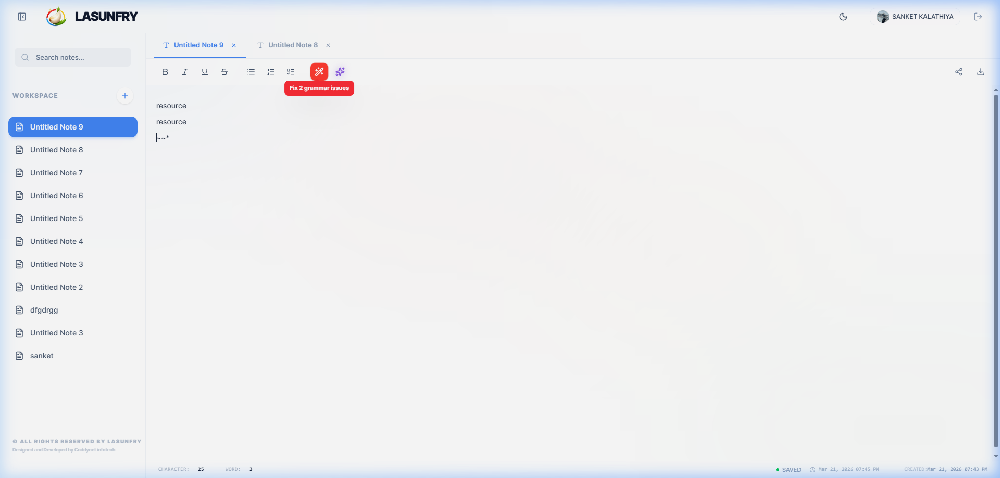
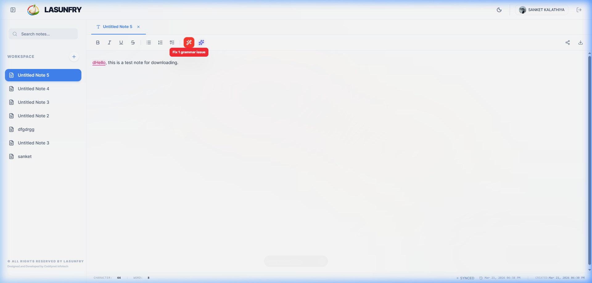

<div align="center">
  
  <h1>LasunFry Workspace</h1>
  <p><strong>The Premium, Aesthetically-Driven Markdown Editor & File Manager</strong></p>
  
  <p>
    
    
    
    
  </p>
</div>

---

## Overview

**LasunFry** is a highly optimized markdown and text editor engineered for developers, technical writers, and power-users who require uncompromising speed paired with superior interface aesthetics. The application strongly leverages **SlateJS** for robust rich-text editing, fused with proprietary **Glassmorphism UI** elements, dynamic theme synchronization, and advanced offline capabilities.

---

## Architecture & Advanced Features

### 1. High-Performance Markdown Engine
Write seamlessly with instant rich-text formatting. The custom parsing infrastructure implements a safe **Reverse-Priority Flow** capable of handling deeply nested Markdown formats with atomic DOM replacement. This strictly prevents typing latency, parsing blockage, or unexpected cursor displacement during rapid input.

### 2. QR File Distribution Protocol
Instantly distribute notes out of the localized environment using advanced algorithmic QR codes:
- **Dotted Aesthetics**: Implements precise, rounded dot matrices and corner localization squares diverging from traditional rigid geometries.
- **Embedded Branding**: The core system logo is natively injected into the center of the generated QR matrix, fortified by a high-error-correction (`level="H"`) redundancy algorithm.
- **Sharable Glassmorphic Templates**: Users can initiate an immediate download compiling the QR code into an offline-ready, fully branded HTML-to-Image composition synchronized to the current system interface theme.

<details>
<summary><b>View QR Rendering Implementation</b></summary>

```tsx
import { QRCode } from 'react-qrcode-logo';

<QRCode
  value={shareUrl}
  size={240}
  ecLevel="H"
  qrStyle="dots"
  eyeRadius={12}
  quietZone={5}
  logoImage="/logo.png"
  logoWidth={64}
  logoHeight={64}
  logoPadding={0}
  logoPaddingStyle="circle"
  removeQrCodeBehindLogo={true}
  bgColor="transparent"
  fgColor="#000000"
/>
```
</details>

### 3. Reactive Theming & UI
Meticulously structured using Tailwind CSS, LasunFry responds fluidly to system color-scheme preferences. UI components feature sub-pixel shadow rendering, floating state animations, and explicit backdrop-blur masks for a native application feel. List structures dynamically fade into transparency using CSS `mask-image` intersections.

<div align="center">
  
  <br>
  <i>Figure 1: The core editing workspace demonstrating dynamic markdown application.</i>
</div>

### 4. Local File System Integration
Fully bridged with the native **File System Access API**. Save output directly to disk, alter file nomenclature asynchronously within the sidebar, and extract raw `.md` or `.txt` content dynamically.

<div align="center">
  
  <br>
  <i>Figure 2: Real-time file downloading and workspace organization.</i>
</div>

---

## Deployment & Getting Started

Retrieve the repository and initialize the development server via the following commands:

```bash
# 1. Clone the repository
git clone https://github.com/coddyNet/Lasunfry.git

# 2. Install dependencies
npm install

# 3. Compile and initialize local instance
npm run dev
```

---

<p align="center">
  <i>Developed and engineered for maximum aesthetic utility.</i><br>
  <b>LasunFry System Software</b>
</p>
